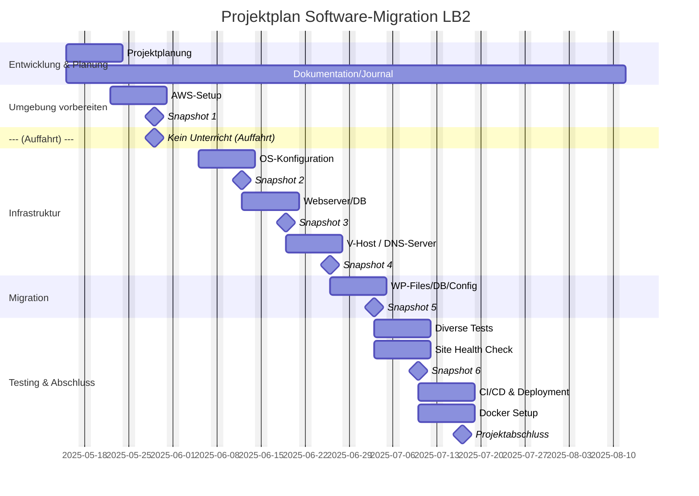

```mermaid
gantt

    title Projektplan Software-Migration LB2

    dateFormat  DD-MM-YYYY

    excludes    weekends

  

    section Entwicklung & Planung

    Projektplanung         :a1, 15-05-2025, 1w

    Dokumentation/Journal  :a2, 15-05-2025, 9w

  

    section Umgebung vorbereiten

    AWS-Setup              :b1, 22-05-2025, 1w

    Snapshot 1             :milestone, b2, 29-05-2025, 0d

  

    section --- (Auffahrt) ---

    Kein Unterricht (Auffahrt) :milestone, ex1, 29-05-2025, 0d

  

    section Infrastruktur

    OS-Konfiguration       :c1, 05-06-2025, 1w

    Snapshot 2             :milestone, c2, 12-06-2025, 0d

    Webserver/DB           :c3, 12-06-2025, 1w

    Snapshot 3             :milestone, c4, 19-06-2025, 0d

    V-Host / DNS-Server    :c5, 19-06-2025, 1w

    Snapshot 4             :milestone, c6, 26-06-2025, 0d

  

    section Migration

    WP-Files/DB/Config     :d1, 26-06-2025, 1w

    Snapshot 5             :milestone, d2, 03-07-2025, 0d

  

    section Testing & Abschluss

    Diverse Tests          :e1, 03-07-2025, 1w

    Site Health Check      :e2, 03-07-2025, 1w

    Snapshot 6             :milestone, e3, 10-07-2025, 0d

    CI/CD & Deployment     :f1, 10-07-2025, 1w

    Docker Setup           :f2, 10-07-2025, 1w

    Projektabschluss       :milestone, f3, 17-07-2025, 0d
```
