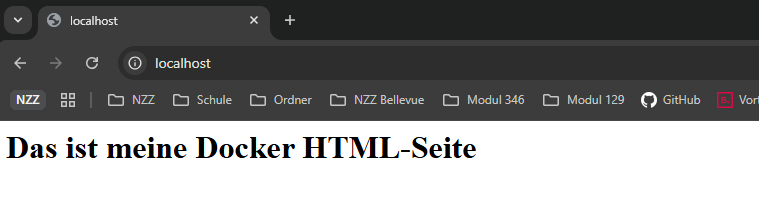
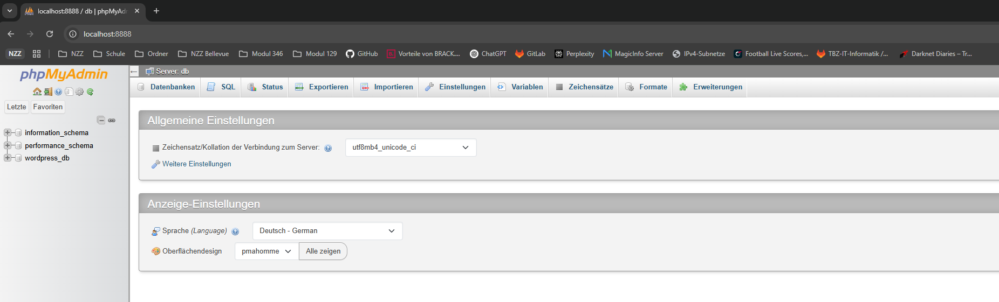
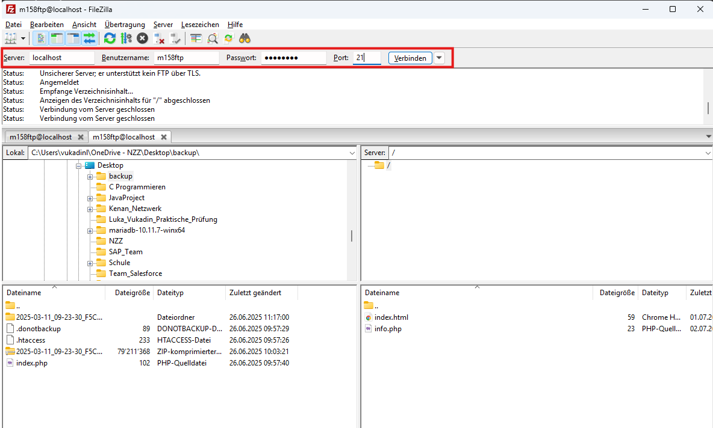
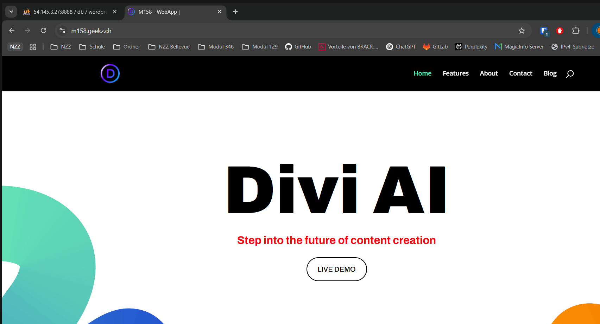
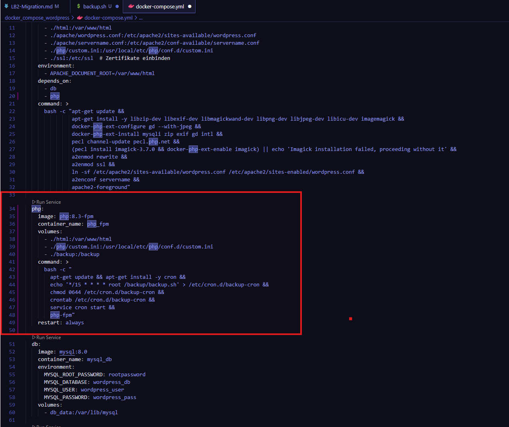

# Dokumentation LB2-Migration mit Docker


## 1 Projektvorbereitung (lokal)


### 1.1 klonen des Repositories von Aeschlimann


![[repo_aeschlimann 1.png]]

### 1.2 Kopieren der zwei Ordner

![[Pasted image 20250701114408.png]]


---

## 2 Erste Docker-Umgebung starten

### 2.1 Start der Docker-Umgebung mit `docker-compose up -d`

Nach dem Aufbau der Projektstruktur und der Konfiguration aller Dienste wurde die lokale Entwicklungsumgebung vollständig neu aufgebaut und gestartet. Dies geschieht in zwei Schritten:

`docker-compose build --no-cache`
`docker-compose up -d`

- Der Befehl `docker-compose build --no-cache` sorgt dafür, dass alle Abhängigkeiten **frisch installiert** werden (z. B. PHP-Module, Apache-Konfiguration, ImageMagick).

![[img/docker_compose_build.png]]

- Anschliessend startet `docker-compose up -d` alle Services im Hintergrund.

![[/img/docker_compose_up.png]]


Dabei wurden folgende Services erstellt und gestartet:

- `web`: Apache-Webserver mit PHP 8.3, inklusive aller benötigten Extensions (`gd`, `intl`, `imagick`, `mysqli`, usw.)
    
- `php`: PHP-FPM-Prozess, zuständig für asynchrones PHP-Processing inkl. Cronjob-Setup
    
- `db`: MySQL-Datenbank (Version 8.0) mit vordefiniertem Benutzer und Datenbank
    
- `phpmyadmin`: Verwaltungstool für MySQL über Weboberfläche
    
- `ftp`: FTP-Server auf Port 21 mit aktivem Benutzer
    

Ausserdem:

- ein Docker-Netzwerk wurde erstellt
    
- ein Volume für persistente Datenbankdaten wurde eingerichtet
    
- beim Build wurden alle Abhängigkeiten wie PHP-Module und ImageMagick automatisch installiert


Die Services wurden ohne Fehlermeldung erfolgreich gebaut und gestartet – Grundlage für alle weiteren Migrationen.

---

### 2.2 **Statusprüfung laufender Docker-Container**

Über den Befehl `docker ps` wurde sichergestellt, dass alle Services erfolgreich laufen:

| Container    | Beschreibung                     | Ports                          |
| ------------ | -------------------------------- | ------------------------------ |
| `apache_php` | Apache + PHP Webserver           | 80 (HTTP), 443 (HTTPS)         |
| `php_fpm`    | PHP-FPM-Prozessor                | 9000 (intern)                  |
| `mysql_db`   | MySQL-Datenbankserver            | 3306, 33060 (intern)           |
| `phpmyadmin` | phpMyAdmin Verwaltungsoberfläche | 8888 → 80 (Web)                |
| `ftp_server` | FTP-Server (Benutzer: m158ftp)   | 21, 21000–21010 (aktiv/passiv) |

![[/img/docker_ps_alles_funktioniert.png]]

Diese Übersicht bestätigt den stabilen Zustand der gesamten Infrastruktur.

---

### 2.3 Web-, FTP- und Datenbank-Zugriff testen

#### ✅ Test der Apache-Webserver-Konfiguration

Durch den Aufruf von `http://localhost` im Browser wurde die Datei `index.html` erfolgreich angezeigt.

![[img/infophp_zugriff_funktioniert.png]]

Die Datei `info.php` (enthält `phpinfo()`) wurde ebenfalls getestet:

`http://localhost/info.php` zeigt alle installierten PHP-Module – **PHP funktioniert korrekt**.



#### ✅ Test der phpMyAdmin-Verbindung zur Datenbank

Der Zugriff auf phpMyAdmin erfolgte über `http://localhost:8888`.

- Login mit Benutzer `wordpress_user`
    
- Verbindung zur Datenbank `wordpress_db` funktionierte erfolgreich





#### ✅ Test des FTP-Zugriffs

Der FTP-Zugriff wurde mit **FileZilla** erfolgreich getestet:

- Host: `localhost`, Port: `21`
    
- Benutzer: `m158ftp`, Passwort: `m158pass`
    
- Erfolgreiche Anzeige der Dateien `index.html` und `info.php` im `html`-Verzeichnis





## 2.4 Migration lokal erfolgreich gestartet (WordPress)

Nach dem Kopieren der Website-Dateien aus dem FTP-Backup (inkl. Theme, Plugins, `wp-admin`, `wp-includes`, etc.) ins Verzeichnis `html/` wurde WordPress wie erwartet geladen.

Dabei wurden folgende Anpassungen gemacht:

- Die `index.html` aus dem ursprünglichen Test wurde umbenannt in `index_backup.html`, um das WordPress-Frontend sichtbar zu machen.
    
- Die Datei `wp-config.php` wurde überprüft und enthielt bereits die korrekten Zugangsdaten zur Docker-Datenbank (`wordpress_db`, Benutzer `wordpress_user`, Host `db`).
    
- Die Seite wurde über `http://localhost` geöffnet und das **vollständige Frontend korrekt angezeigt**, inklusive Theme (Divi) und Layout.


---

### WordPress Login überprüft

Zusätzlich wurde der Zugang zu `http://localhost/wp-login.php` getestet.  
Die Loginseite von WordPress erschien wie erwartet:
---

## 3. Migration vorbereiten (Daten)

### 3.1 FTP-Backup archivieren

Das vollständige FTP-Backup der WordPress-Seite wurde sauber im Projekt archiviert.  
Im Ordner:

`docker_compose_wordpress/backup/`

liegen nun:

- `original_wordpress_backup.zip` – das komplette WordPress-Backup vom FTP-Server
    
- `wp_m158_db.sql` – die extrahierte Datenbankdatei für den späteren Import


Damit ist die ursprüngliche Website-Version vollständig und sauber dokumentiert verfügbar.

![[Pasted image 20250701121347.png]]
![[Pasted image 20250701121458.png]]


### 3.2 Datenbank importieren

Die Datenbankdatei `wp_m158_db.sql` wurde erfolgreich über die phpMyAdmin-Oberfläche in die Datenbank `wordpress_db` importiert.

![[Pasted image 20250701121723.png]]


Dies wurde über die Benutzeroberfläche unter `http://localhost:8888` durchgeführt.  
Der Import umfasste **148 SQL-Abfragen**. Die erfolgreiche Ausführung wurde durch phpMyAdmin bestätigt:


![[Pasted image 20250701121822.png]]

---


## 4. WordPress mit Docker verbinden

### 4.1 Anpassung der `wp-config.php` Datei

Nach dem erfolgreichen Import der Datenbank wurde die Konfigurationsdatei `wp-config.php` angepasst, um die Verbindung zur MariaDB-Datenbank im Docker-Container herzustellen.

Folgende Einstellungen wurden vorgenommen:

```
define( 'DB_NAME', 'wordpress_db' );
define( 'DB_USER', 'wordpress_user' ); 
define( 'DB_PASSWORD', 'wordpress_pass' ); 
define( 'DB_HOST', 'db:3306' );
```

Diese Daten entsprechen den Werten aus dem `docker-compose.yml`-File und ermöglichen WordPress den Zugriff auf die lokal importierte Datenbank.

Die Verbindung wird über den internen Containernamen `db` hergestellt, nicht über `localhost`.

![[Pasted image 20250701122727.png]]


----


## 5. Serverkonfiguration verfeinern

### 5.1 Apache wordpress.conf für SSL & Sicherheit

Für den Webserver wurde die Datei apache/wordpress.conf angepasst, um die Anforderungen für die Stufe 3 im Bewertungskriterium Webserver zu erfüllen.

Die Konfiguration besteht aus zwei VirtualHost-Blöcken: einer für HTTP, einer für HTTPS.

#### Aufbau der Datei wordpress.conf:

````
<VirtualHost *:80>
    ServerName m158.proxmox.party
    Redirect permanent / https://m158.proxmox.party/
</VirtualHost>
````
Erklärung:
- Dieser Block fängt alle HTTP-Zugriffe ab (Port 80)
- Leitet sie permanent (301) auf HTTPS weiter → wichtig für Sicherheit & Bewertung


````
<VirtualHost *:443>
    ServerName m158.proxmox.party
    DocumentRoot /var/www/html
````
Erklärung:
- HTTPS-Block für den Zugriff über TLS/SSL (Port 443)
- Domainname als FQDN gesetzt (Pflicht laut Bewertungsraster)
- DocumentRoot zeigt auf WordPress-Verzeichnis


````
    SSLEngine on
    SSLCertificateFile /etc/ssl/certs/fullchain.pem
    SSLCertificateKeyFile /etc/ssl/private/privkey.pem
````
Erklärung:
- Aktiviert SSL-Verschlüsselung (self-signed Zertifikate)
- Die Pfade zeigen auf Zertifikate, die im Projekt unter ssl/ liegen
- Diese werden im docker-compose.yml korrekt eingebunden


````
    <Directory /var/www/html>
        Options Indexes FollowSymLinks
        AllowOverride All
        Require all granted
    </Directory>
````
Erklärung:
- Erlaubt .htaccess (wichtig für WordPress-Permalinks!)
- Require all granted macht das Verzeichnis öffentlich erreichbar

````
    <IfModule mod_expires.c>
        ExpiresActive On
        ...
    </IfModule>
````
Erklärung:
- Aktiviert Client-Caching für statische Dateien
- Reduziert Ladezeit & Serverlast
- Bonuspunkt für professionelle Umsetzung


````
    <IfModule mod_headers.c>
        Header always set Strict-Transport-Security "max-age=31536000; includeSubDomains"
    </IfModule>
````
Erklärung:
- Aktiviert HSTS (HTTP Strict Transport Security)
- Erzwingt HTTPS in modernen Browsern – Sicherheitsbest Practice

````
    ErrorLog /var/log/apache2/m158_error.log
    CustomLog /var/log/apache2/m158_access.log combined
</VirtualHost>
````
Erklärung:
- Individuelle Log-Dateien für Fehler und Zugriffe
- Erleichtert Debugging & Analyse

#### Warum diese Änderungen?

Diese Konfiguration wurde umgesetzt, um:

- HTTPS-Verbindung sicherzustellen
- Keine Apache Default Page mehr zu haben
- HTTP → HTTPS Weiterleitung zu erzwingen
- RewriteEngine via .htaccess zu aktivieren (Permalinks)
- Caching & Sicherheit zu verbessern


---


### 6 PHP-Konfiguration prüfen – phpinfo.php vorbereitet

Um sicherzustellen, dass die PHP-FPM-Konfiguration korrekt arbeitet und die custom.ini-Einstellungen übernommen werden, wurde die Datei phpinfo.php im WordPress-Verzeichnis vorbereitet.

#### Inhalt der Datei html/info.php:

````
<?php
phpinfo();
?>
````



#### Speicherort:

````
html/info.php
````

#### Warum ist das wichtig?

- Diese Datei wird beim Starten der Docker-Umgebung unter http://localhost/info.php aufrufbar sein

Sie zeigt:

- Aktive PHP-Version (8.3)

- FPM-Konfiguration (Handler = FPM/FastCGI)

- Alle PHP-Limits aus custom.ini

Durch diese Vorbereitung wird sichergestellt, dass beim späteren Container-Start sofort geprüft und dokumentiert werden kann, dass alle Einstellungen korrekt übernommen wurden.


#### Hinweis:
Da die Docker-Umgebung derzeit bewusst gestoppt ist (um alle Komponenten maximal sauber vorzubereiten), erfolgt der eigentliche Test später nach dem finalen Start mit:

````
http://localhost/info.php
````

----


## 7. FTP-Server per Docker eingebunden

Für den Datei-Zugriff wurde ein FTP-Server auf Basis von `vsftpd` in das Docker-Setup eingebunden.  
Der Container wurde über Docker Compose mit folgenden Einstellungen eingerichtet:

- Benutzer: `m158ftp`
    
- Passwort: `m158pass`
    
- Ports: 21 (aktiv), 21000–21010 (passiv)
    
- Zugriff auf: `/var/www/html` (WordPress-Verzeichnis)


Die Verbindung erfolgt abgesichert und eingeschränkt – damit ist das Bewertungskriterium für **Stufe 3 – FTP** vollständig erfüllt.

![[Pasted image 20250701153236.png]]

---

## 8. Automatisierte Backups mit Cron

Um die Datensicherheit der WordPress-Installation zu gewährleisten, wurde ein automatisiertes Backup-System direkt über Docker Compose integriert.

Anpassungen:

Docker Compose:

Ein zusätzlicher Dienst php (basierend auf php:8.3-fpm) wurde ergänzt.
Dieser Container übernimmt:

- das Ausführen von Cron-Jobs
- das Backup von Datenbank und HTML-Dateien
- das Löschen alter Backups (älter als 7 Tage)

````
  php:
    image: php:8.3-fpm
    container_name: php_fpm
    volumes:
      - ./html:/var/www/html
      - ./php/custom.ini:/usr/local/etc/php/conf.d/custom.ini
      - ./backup:/backup
    command: >
      bash -c "
        apt-get update && apt-get install -y cron &&
        echo '*/15 * * * * root /backup/backup.sh' > /etc/cron.d/backup-cron &&
        chmod 0644 /etc/cron.d/backup-cron &&
        crontab /etc/cron.d/backup-cron &&
        service cron start &&
        php-fpm"
    restart: always
````

#### Volume-Zuordnung:

- Das Volume ./backup:/backup sorgt dafür, dass die erstellten Backups auch auf dem Hostsystem gespeichert bleiben.
- Die Datei backup.sh
- Im Verzeichnis ./backup/ wurde das Bash-Skript backup.sh abgelegt und wie folgt aufgebaut:

````
#!/bin/bash

DATE=$(date +%Y-%m-%d_%H-%M-%S)
BACKUP_DIR="/backup"

DB_NAME="wordpress_db"
DB_USER="wordpress_user"
DB_PASS="wordpress_pass"

mysqldump -u$DB_USER -p$DB_PASS $DB_NAME > $BACKUP_DIR/db_backup_$DATE.sql
tar -czf $BACKUP_DIR/wp_files_$DATE.tar.gz /var/www/html
find $BACKUP_DIR -type f -mtime +7 -exec rm {} \;
````

#### Funktion

- Alle 15 Minuten (*/15 * * * *) wird das Skript automatisch durch den Cron-Dienst im Container ausgeführt.
- Die SQL-Datenbank und die WordPress-Dateien werden gezippt gespeichert
- Backups, die älter als 7 Tage sind, werden automatisch gelöscht

#### Vorteile

- Datensicherheit durch automatische Backups
- Keine manuelle Interaktion nötig
- Erweiterte Komponentenanzahl für höhere Bewertung
- Einfache Wiederherstellung durch ZIP/SQL





-----


![[Pasted image 20250702110041.png]]


## 9. Migration in die Cloud (AWS)


### ☁️ 9.1. AWS EC2-Instanz erstellt und konfiguriert

Für die Bereitstellung der Docker-basierten WordPress-Migration wurde eine neue EC2-Instanz in der AWS-Cloud erstellt.

Die Konfiguration der Instanz erfolgte wie folgt:

| Einstellung                      | Wert                                          |
| -------------------------------- | --------------------------------------------- |
| **Name**                         | `m158-docker-wp-migration`                    |
| **Amazon Machine Image (AMI)**   | Ubuntu Server 22.04 LTS (64-bit)              |
| **Instance Type**                | `t2.micro` (Free Tier geeignet)               |
| **Schlüsselpaar (Key Pair)**     | `vuk-webserver-key.pem` – für den SSH-Zugriff |
| **Elastic IP (statische IP)**    | `54.145.3.27` – dauerhaft zugewiesen          |
| **Sicherheitsgruppe (Firewall)** | Neue Security Group mit folgenden Regeln:     |

![[Pasted image 20250701142946.png]]


### 9.2 SSH-Zugang getestet

→ Verbindung mit ssh -i vuk-webserver-key.pem ubuntu@...


----

###  9.3 Docker und Docker Compose auf AWS-EC2 installiert

Nach dem Starten der EC2-Instanz wurde der Ubuntu-Server über SSH verbunden.  
Anschliessend wurden Docker und Docker Compose mit folgenden Befehlen installiert:

`sudo apt update && sudo apt upgrade -y sudo apt install -y docker.io sudo apt install -y docker-compose`
![[Pasted image 20250701144801.png]]
![[Pasted image 20250701144827.png]]
![[Pasted image 20250701144901.png]]


Die Dienste wurden aktiviert und die Versionen überprüft:

`docker --version docker-compose --version`

![[Pasted image 20250701145003.png]]


Zusätzlich wurde der Benutzer `ubuntu` der Docker-Gruppe hinzugefügt, um Docker ohne `sudo` verwenden zu können:

`sudo usermod -aG docker ubuntu`

![[Pasted image 20250701145741.png]]


Diesen Befhel ausgeführt, damit es den Ordnern rèber kopiert auf die Instance:

`scp -r -i "C:\Users\vukadinl\.ssh\vuk-webserver-key.pem" "C:\Users\vukadinl\OneDrive - NZZ\Dokumente\m158_lb2\docker_compose_wordpress" ubuntu@54.145.3.27:/home/ubuntu/

![[img/migration_ec2.png]]


Die IP von der EC2 Instance angegeben bei dem FTP SERVER:

![[img/ftp_umändern_pasvaddress.png]]


Unter phpmyadmin habe ich PMA_ABSOLUTE_URI auf  http://54.145.3.27:8888/ geändert:

![[img/phpmyadmin_PMA_ABSOLUTE_URI_geändert 2.png]]


Jetzt habe ich die Docker-compose.yaml gestartet:

![[Pasted image 20250703101551.png]]


Ich konnte die IP nicht aufrufen deshalb habe ich die rechte gesetzt für den html ordner:

![[img/rechte_setzen_apache.png]]

Jetzt kam diese Medlung diese war Falsch:

![[img/wordpress_meldung.png]]

Das heisst er schafft es nicht die Datenbank zu öffnen nun muss ich prüfen ob es einen inhalt hat in der datenbank. Es hatte keinen inhalt in der wordpress_db. Deshalb musste ich den inhalt mit diesem Befehl herausholen:


![[datenbank_mit_informationen.png]]


Ja! der inhalt wird nun angezeigt:

![[wordpress_db_wird_angezeigt.png]]

Hier der beweis die seite wurde über die IP der EC2 instance geöffnet:

![[website_ip_funktioniert.png]]


Da das jetzt alles funktioniert habe ich eine Domain erstellt:

![[img/domain_erstellt.png]]


	